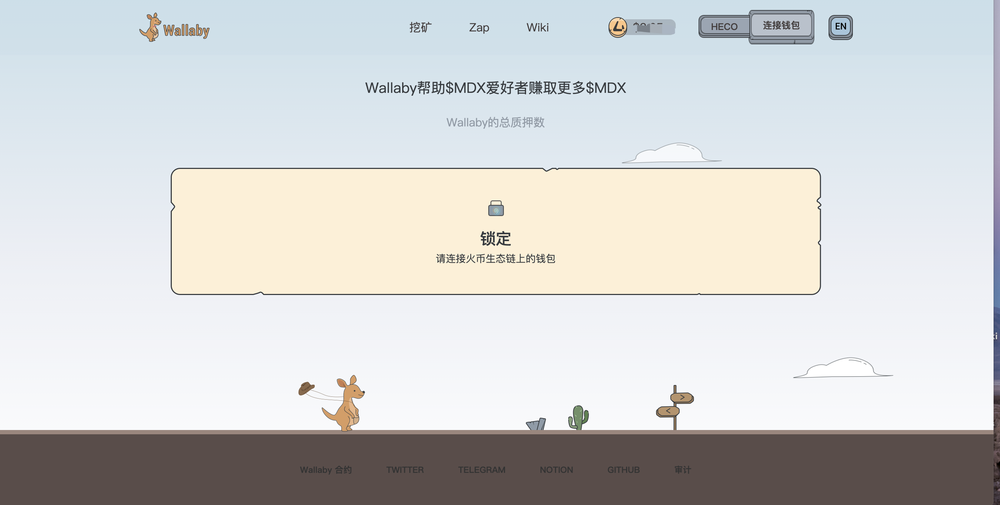
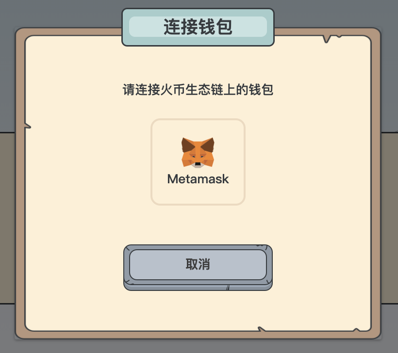
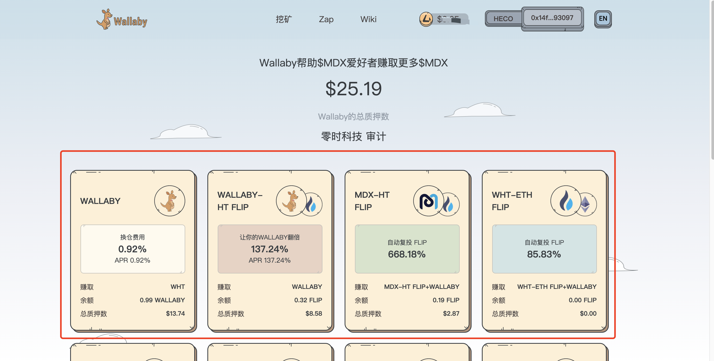
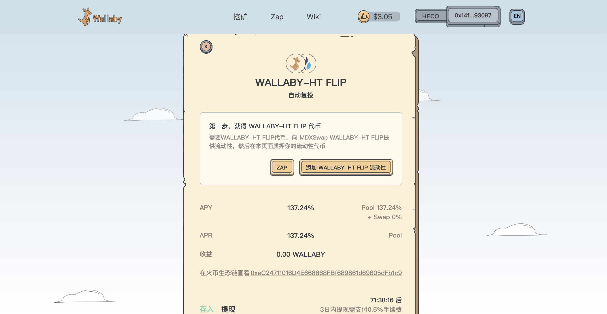
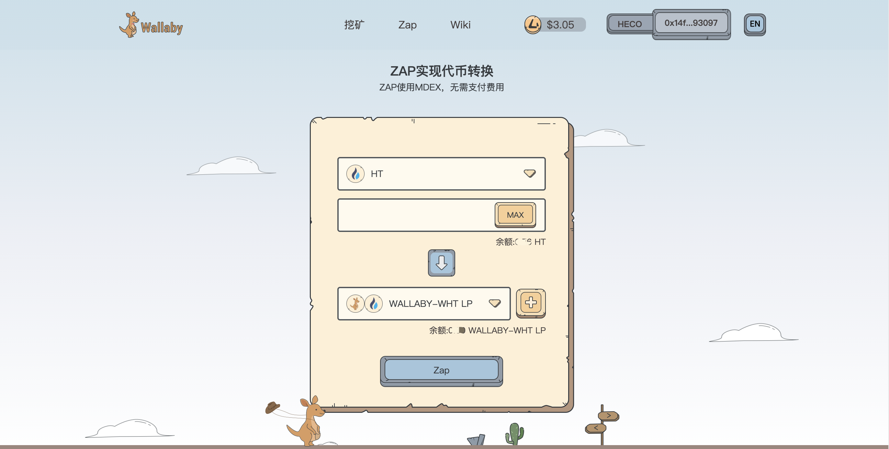
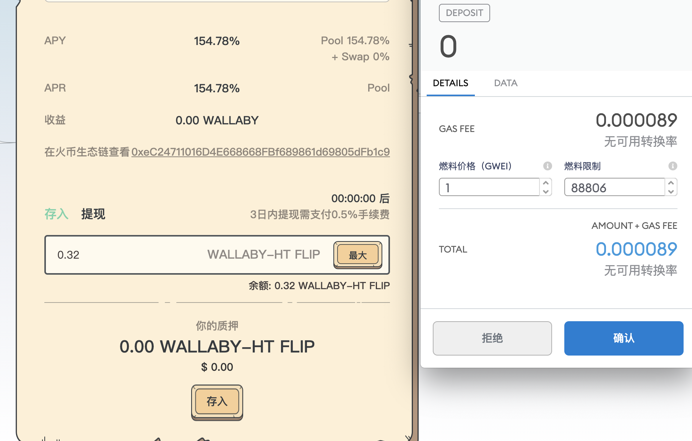

入门指南
=============

您必须具有特定池子的基础令牌。 对于MDX-WHT，您需要MDX令牌和WHT令牌。 其他各个池子也是如此。

您必须拥有受支持的钱包，即Metamask，或 Trust Wallet！

例子
======
1 转到Wallaby.finance/，然后单击“连接钱包”

2 根据您的使用情况，单击“ Metamask”

3 选择您要投资的池子

4 您需要LP代币（LP代币）（Wallaby-WHT LP，MDX-WHT LP, MDX-USDT LP等）

您还可以使用我们的Zap功能，只需单击一下即可提供LP令牌。
 

5 收到LP代币后，输入您要存入的代币数量，然后单击“存入”

6 使用Metamask或WalletConnect确认交易

在HecoInfo上查看交易并等待确认

恭喜！ 您现在已经加入了袋鼠农场！

